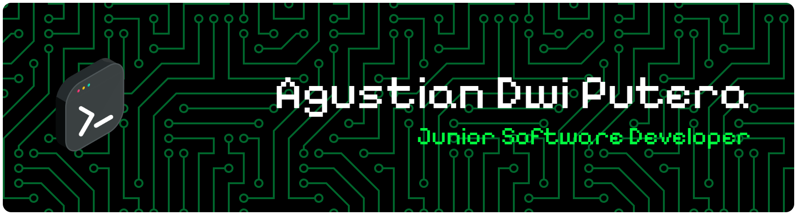

<!-- Typing Animation -->

  

<!-- Animated Developer GIF -->

## 👋 About Me
I’m **Agustian Dwi Putera**, a passionate **Junior Software Developer** who enjoys building modern, clean, and scalable applications.  
I love exploring new technologies and writing code that solves real problems.

- 💻 Focus on **Web Development**
- 🧠 Currently improving my skills in **React.js** & **Laravel**
- 🔥 Love minimalist UI/UX and clean code
- 🤝 Open for collaborations & freelance projects
- ☕ Coffee-driven learning attitude

---

## 📚 Currently Learning
I’m actively learning:

- ⚛️ **React.js (Hooks, State, Routing)**
- 🎨 Tailwind CSS
- 🗄️ REST API Integration
- 🧪 Code optimization and clean structure

---

## 🛠 Tech Stack

  

---

## 🔗 Connect With Me

  
  
  

---

## 🚀 Portfolio
Here are some of my works and documents:

- 📁 **Portfolio (Google Drive)** →  
  https://drive.google.com/file/d/1Ljq3JVP8R_xV68C79OOWysN8x1mjjL94/view?usp=sharing

More GitHub projects will be added soon as I continue building Laravel + React applications.

---

## 📊 GitHub Stats

  

---

## 🟩 Contribution Snake (Neon)

  

 
